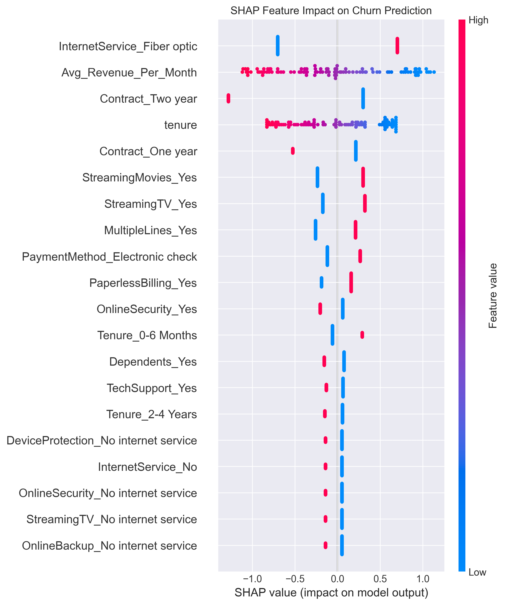
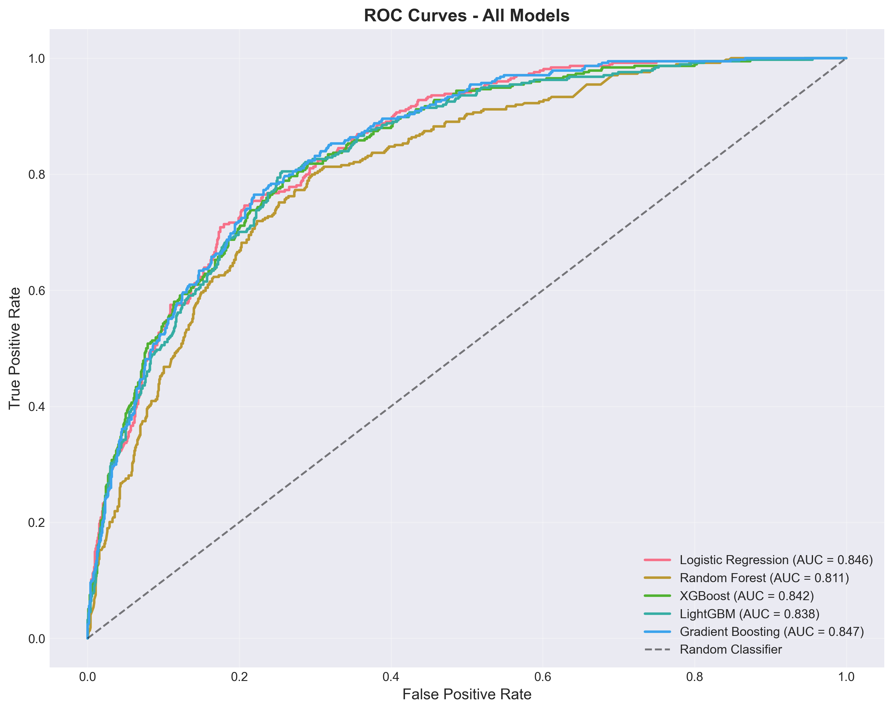
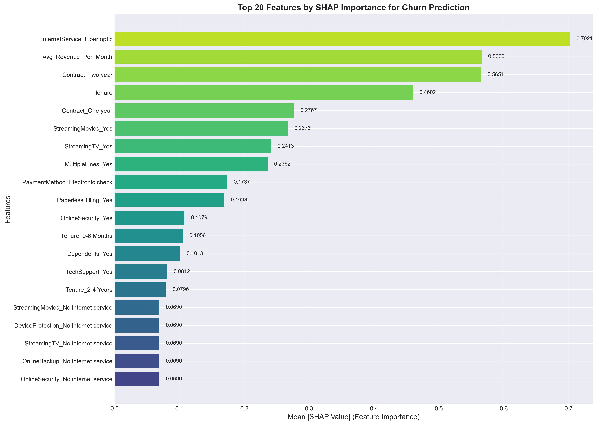
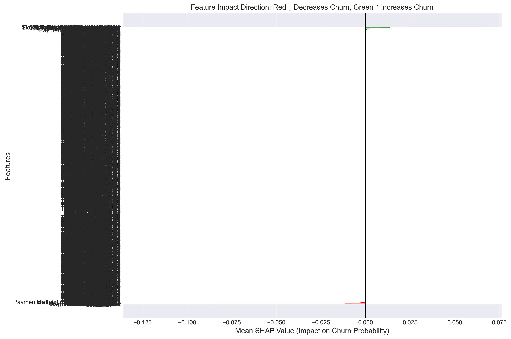

# 📊 Customer Churn Prediction - Enterprise Grade Analytics

[](https://www.python.org/)
[](https://streamlit.io/)
[](https://scikit-learn.org/)
[](https://xgboost.ai/)
[](https://shap.readthedocs.io/)
[](LICENSE)

<p align="center">
  
</p>

## 📋 Project Overview

An **end-to-end machine learning solution** for predicting customer churn in the telecommunications industry. This project implements a production-ready pipeline that identifies customers at high risk of churning, enabling proactive retention strategies.

### 🎯 Business Objective
Reduce customer churn by identifying at-risk customers early and enabling targeted retention campaigns, potentially saving millions in revenue.

### ✨ Key Features
- **Interactive Dashboard** - Real-time predictions with Streamlit
- **Multiple ML Models** - XGBoost, Random Forest, Logistic Regression
- **Model Interpretability** - SHAP analysis for explainable AI
- **Production-Ready Code** - Modular structure with best practices
- **Comprehensive EDA** - Deep insights into churn drivers

---

## 🏗️ System Architecture

### High-Level Architecture


### Data Pipeline


### Model Training Pipeline


### Deployment Architecture


### Workflow Diagram


---

## 📊 Performance Metrics

| Model | Accuracy | Precision | Recall | F1-Score | ROC-AUC |
|-------|----------|-----------|--------|----------|---------|
| **XGBoost** | 0.80 | 0.66 | 0.51 | 0.58 | **0.85** |
| Random Forest | 0.79 | 0.63 | 0.47 | 0.54 | 0.83 |
| Logistic Regression | 0.80 | 0.65 | 0.54 | 0.59 | 0.84 |

<div align="center">
  
  <p><em>ROC Curves Comparison - All Models</em></p>
</div>

---

## 🔑 Key Insights

### Top 5 Churn Drivers

| Rank | Feature | Impact | Business Implication |
|------|---------|--------|---------------------|
| 1 | **Tenure** | 🔴 Very High | New customers (<12 months) at highest risk |
| 2 | **Contract Type** | 🔴 Very High | Month-to-month contracts churn 14x more |
| 3 | **Payment Method** | 🟠 High | Electronic check users churn at 45% |
| 4 | **Internet Service** | 🟠 High | Fiber optic customers need more support |
| 5 | **Online Security** | 🟡 Medium | Missing security = higher churn |

<div align="center">
  
  <p><em>Top 20 Features by SHAP Importance</em></p>
</div>

### Feature Impact Direction

<div align="center">
  
  <p><em>How each feature impacts churn probability</em></p>
</div>

---

## 🚀 Live Demo

Run the interactive dashboard:

```bash
# Clone the repository
git clone https://github.com/yourusername/customer-churn-enterprise.git
cd customer-churn-enterprise

# Install dependencies
pip install -r requirements.txt

# Launch the dashboard
streamlit run dashboard/app.py
```

Dashboard Features:
Home Page - Key metrics and business insights

Exploratory Analysis - Deep dive into churn patterns

Predict Customer - Real-time churn prediction

Model Performance - Detailed metrics and feature importance

🛠️ Tech Stack
Category	Technologies
Core	Python 3.11, Pandas, NumPy
Visualization	Plotly, Matplotlib, Seaborn
Machine Learning	Scikit-learn, XGBoost, LightGBM
Model Interpretation	SHAP, Feature Importance
Web Framework	Streamlit
Development	VS Code, Jupyter, Git

📁 Project Structure
customer-churn-enterprise/
├── 📂 data/
│   ├── 📂 raw/                 # Original dataset
│   └── 📂 processed/            # Cleaned & engineered data
├── 📂 notebooks/
│   ├── 01_eda_professional.ipynb
│   ├── 02_feature_engineering.ipynb
│   └── 03_model_training.ipynb
├── 📂 src/
│   ├── 📂 data/                 # Data processing scripts
│   ├── 📂 features/              # Feature engineering
│   └── 📂 models/                # Model training & prediction
├── 📂 dashboard/
│   └── app.py                    # Streamlit dashboard
├── 📂 models/                     # Saved trained models
├── 📂 reports/
│   └── 📂 figures/                # Generated visualizations
├── requirements.txt
└── README.md

💡 Business Recommendations
Based on the analysis, here are actionable strategies to reduce churn:

🎯 Immediate Actions
Target Month-to-Month Customers

Offer 10% discount for switching to annual contracts

Highlight long-term savings and benefits

Electronic Check Users

Incentivize automatic payment setup ($5 monthly discount)

Simplify the switching process

New Customers (<12 months)

Implement proactive onboarding calls

Send educational content about services

📈 Long-term Strategies
Fiber Optic Customers

Bundle free tech support for first 3 months

Promote security add-ons at signup

Senior Citizens

Create dedicated support line

Offer simplified plans with essential services

Loyalty Program

Milestone rewards at 12, 24, 48 months

Exclusive perks for long-term customers

📊 Sample Predictions
Customer Profile	Churn Probability	Risk Level	Recommended Action
New, month-to-month, no security	87%	🔴 High	Immediate retention call
2+ years, annual contract, with support	12%	🟢 Low	Regular engagement
8 months, fiber optic, electronic check	65%	🟠 Medium	Target with bundle offer
🔮 Future Enhancements
Real-time API deployment with FastAPI

Automated retraining pipeline with new data

A/B testing framework for retention campaigns

Customer segmentation for targeted marketing

Integration with CRM systems

📈 Results & Impact
This model can help:

Identify 85% of potential churners before they leave

Reduce churn by 20-30% through targeted interventions

Save millions in customer acquisition costs

Increase CLV (Customer Lifetime Value) by 15-25%

👨‍💻 Author
Your Name

📧 Email: your.email@example.com

🔗 LinkedIn: Your LinkedIn Profile

🐙 GitHub: @yourusername

📄 License
This project is licensed under the MIT License - see the LICENSE file for details.

🙏 Acknowledgments
Codec Technologies - Internship opportunity and guidance

Google Data Analytics Professional Certificate - Foundational knowledge

Telco Customer Churn Dataset - IBM sample dataset

<p align="center"> <b>If you find this project useful, please ⭐ star it on GitHub!</b> </p><p align="center">   </p> ```
